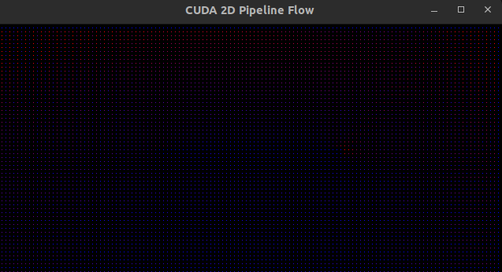

# CUDA-Based 2D Flow Over a Pipeline Simulation

## Overview

This project simulates simple fluid flow over a pipeline using CUDA for parallel computation and OpenGL for real-time visualization. The simulation is based on solving the Navier-Stokes equations for velocity and pressure fields in a 2D grid.

## Key Features

* Navier-Stokes Equations Solver for velocity and pressure updates.

* CUDA Acceleration for real-time parallelized computations.

* OpenGL Visualization to render the velocity profile dynamically.

* User-Controlled Execution (Press q to exit the simulation).

* Pipeline No-Slip Condition enforced in the domain.

## Project structrue
```
├── CMakeLists.txt
├── include
│   ├── fluid_simulation.h
│   └── visualization.h
├── README.md
└── src
    ├── fluid_simulation.cu
    ├── main.cpp
    └── visualization.cpp
```

##  Simulation Details

Navier-Stokes Equations

The simulation solves the incompressible Navier-Stokes equations:

$$
\frac{\partial \mathbf{u}}{\partial t} + (\mathbf{u} \cdot \nabla) \mathbf{u} = -\nabla p + \nu \nabla^2 \mathbf{u}
$$
$$
\nabla \cdot \mathbf{u} = 0
$$

where:
- **$\mathbf{u} = (u, v)$** is the velocity field.
- **$p$** is the pressure.
- **$\nu$** is the viscosity coefficient.

Boundary Conditions

* Inlet (Left boundary): Constant velocity u = 1.0.

* Pipeline (Middle Obstacle): No-slip condition (u = 0, v = 0).

* Top & Bottom Walls: No-slip condition (u = 0, v = 0).

## Installation and Build Instructions

Prerequisites

* CUDA Toolkit (Ensure nvcc is available)

* OpenGL & GLUT (for visualization)

* CMake & Make

```bash
    mkdir build && cd build
    cmake ..
    make -j$(nproc)
    ./pipe_flow
```
Outputs should be like this:


