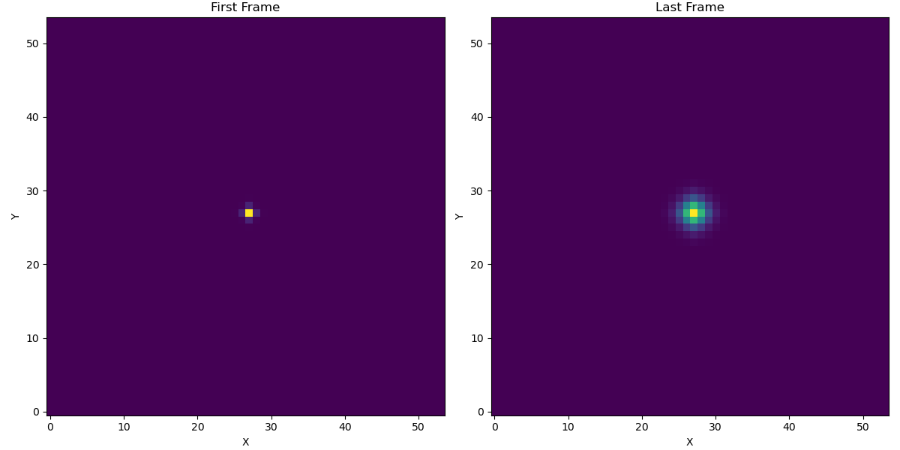

# Fluid Dynamics Simulation: Simulating Navier-Stokes Equations

This project implements a fluid dynamics simulation based on the Navier-Stokes equations using CUDA for parallel computing. The simulation provides outputs that represent the behavior of fluid over time and includes tools for visualization.

# Project Structure

    NavierStokesSim/
    ├── CMakeLists.txt          # Build system configuration
    │
    ├── include/
    │   └── fluid_sim.h         # Header file for fluid simulation functions
    │
    ├── src/
    │   ├── fluid_sim.cu        # CUDA implementation for fluid dynamics
    │   ├── main.cu             # Main entry point for running the simulation
    │
    ├── build/                  # Directory for compiled files 
    │
    ├── datas/                  # simulation output (generated after running)
    │
    └── scripts/                # Python scripts to visualize
        ├── frame_visualizer.py
        └── visualizer.py

# Features

* CUDA Acceleration: Utilizes GPU parallelism for efficient computation of fluid dynamics.

* Simulates Navier-Stokes Equations: Models fluid behavior using numerical methods.

* Visualization Tools: Includes Python scripts to visualize the simulation as an animation or compare the first and last frames.

* CMake Build System: Simplifies building and compiling the project across different systems.

# Simulation Configuration

Simulation parameters can be adjusted in main.cu:

* Grid Size: params.gridSize (default: 128)

* Time Step: params.dt (default: 0.01)

* Viscosity: params.viscosity (default: 0.1)

* Diffusion Coefficient: params.diffusion (default: 0.1)

* Simulation Time: Defined by total_time (default: 5 seconds)

First and last frames are: ... 

