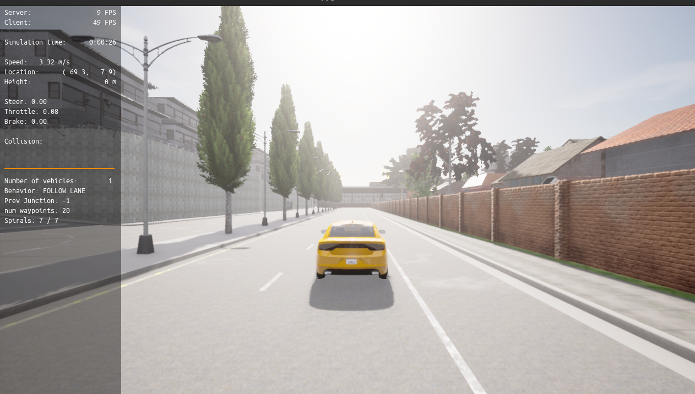
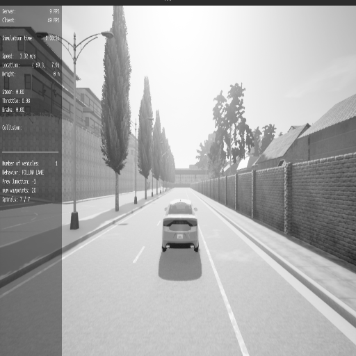

# CUDA FFT Image Filtering

This project demonstrates how to apply **frequency-domain filtering** (e.g., low-pass and high-pass filters) on images using the **Fast Fourier Transform (FFT)** with CUDA. The implementation uses the **cuFFT library** to perform FFT operations on an image, followed by applying a frequency-domain filter.

## Project Structure

    .
    ├── CMakeLists.txt         # CMake build configuration
    ├── include/
    │   └── fft_filter.h       # Header file for CUDA functions
    ├── src/
    │   ├── main.cpp           # Main C++ file that manages the overall logic
    │   ├── fft_filter.cu      # CUDA file containing FFT and filtering functions
    ├── input.jpg              # Example input image (replace with your own image)
    └── README.md              # Project README

## Features

- **CUDA**: Implements FFT using the cuFFT library to perform fast frequency-domain filtering.
- **Image Filtering**: Supports both **low-pass** and **high-pass** filters in the frequency domain.
- **OpenCV**: Loads and saves images in common formats like `.jpg`, `.png`, etc.
- **C++ and CUDA integration**: Separates CUDA functions from the main C++ logic for modular design.

## Dependencies

- **CUDA Toolkit** (with cuFFT library)
- **OpenCV** (for image loading and saving)
- **CMake** (for building the project)

## Installation and Setup

1. Install the required dependencies:
   - [CUDA Toolkit](https://developer.nvidia.com/cuda-toolkit)
   - [OpenCV](https://opencv.org/)
   - [CMake](https://cmake.org/)

## Installation

### 1. Clone the Repository

```bash
    git clone https://github.com/ege2097yilmaz/cuda_practices.git
    cd cuda-fft-image-filter
```

### 2. Build the project

```bash
    mkdirbuild
    cd build
    cmake..
    make
```

### run the program
```
bash
./fft_image_filtering
```

### outputs



