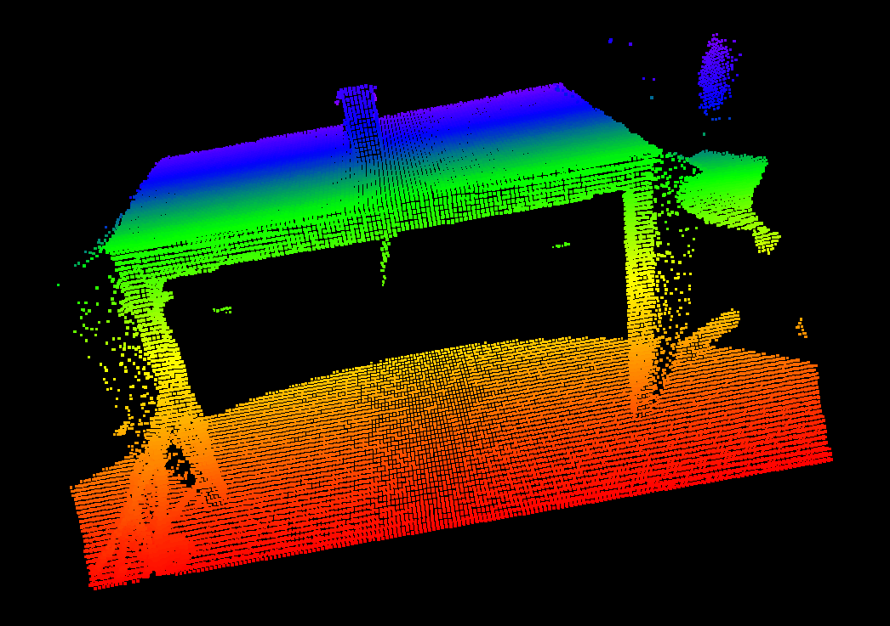
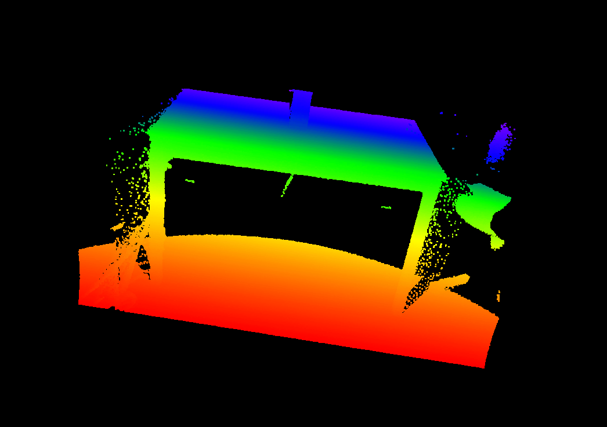

# CUDA Voxel Filter Project
This project implements a voxel grid filter for 3D point clouds using CUDA to accelerate the computation. The voxel filter down-samples the input point cloud by averaging the points that fall within the same voxel (grid cell).

# Porject Structure
    /VoxelFilterProject
    |-- CMakeLists.txt            # CMake configuration file
    |-- include/
    |   |-- voxelFilter.h         # Header file for the voxel filter function
    |-- pcl_data/
    |   |-- sample.pcd            # Sample PCD file (input point cloud)
    |   |-- filtered_sample.pcd   # Filtered PCD file (output point cloud after filtering)
    |-- src/
    |   |-- main.cpp              # Main application file
    |   |-- voxelFilter.cu        # CUDA file for the voxel filter implementation
    |-- README.md                 # This file

# Prerequisites

To run this project, you will need the following:

* CUDA Toolkit: Make sure CUDA is installed and your machine has a compatible NVIDIA GPU.
* Point Cloud Library (PCL): Install PCL for handling point cloud data.
* CMake: Install CMake for building the project.

* Installation
```bash
sudo apt install libpcl-dev
sudo apt install cmake
```

Install CUDA: Install the CUDA Toolkit and ensure your system has a working NVIDIA GPU.

# Building the project
Follow these steps to build the project:

```bash

mkdir build
cd build
cmake ..
make
```

# Run the project
```bash
./voxel_filter

```

# Output
The output (voxel filtered by GPU):




The input pcd file can be seen:



# Code Overview
* main.cpp: Handles loading the input PCD file, calling the voxel filter function, and saving the filtered point cloud.
* voxelFilter.cu: Contains the CUDA implementation of the voxel filter. It operates on the point cloud data and applies grid down-sampling using CUDA parallelism.
* CMakeLists.txt: Specifies the CMake build configuration, linking CUDA and PCL libraries.